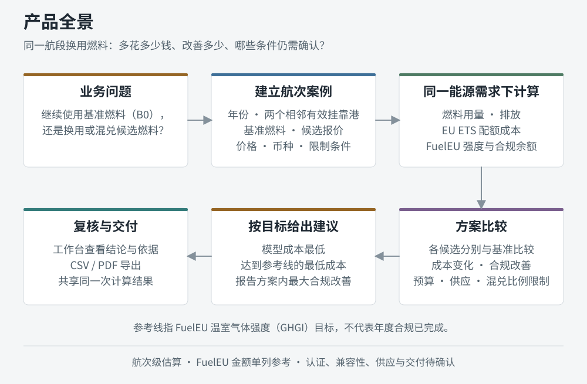
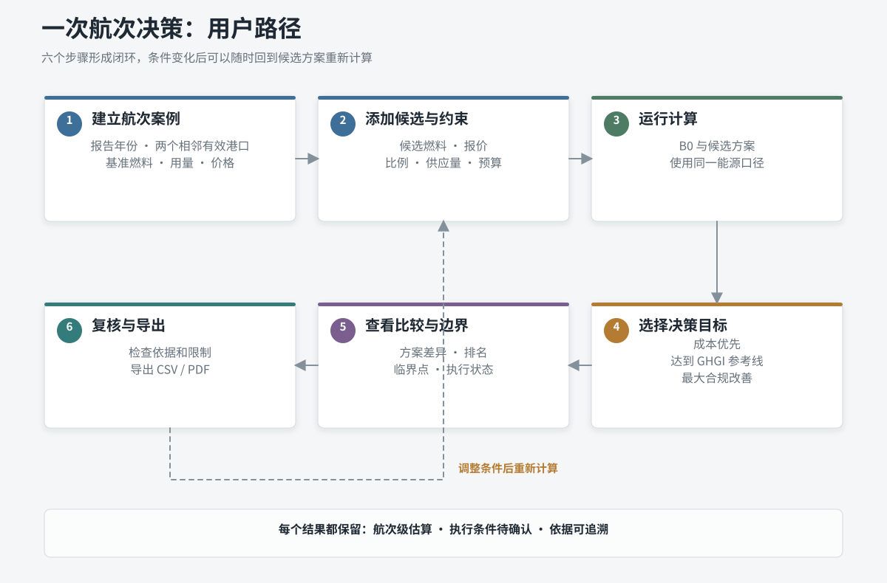
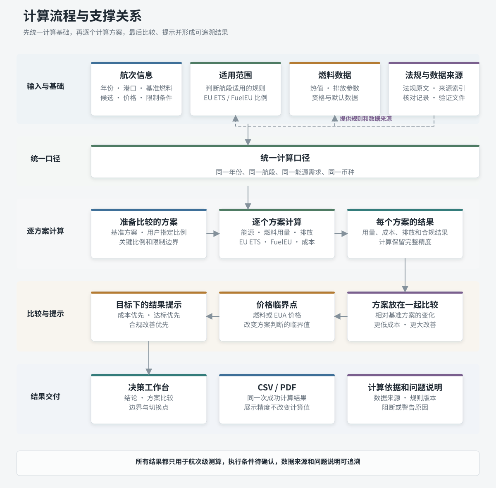

# 航次燃料决策 MVP

单航次 FuelEU / EU ETS 燃料方案计算与比较工具。

项目面向船东、租家、燃油采购和燃料供应相关人员，回答一个问题：**同一航段换用或混兑燃料后，要多花多少钱，能改善多少合规表现，在预算和供应限制下是否可行？**

用户输入航段、基准燃料、候选报价和限制条件，系统计算用量、成本与排放，给出按目标区分的方案比较，并导出 CSV / PDF。

**首次体验：**启动后进入决策工作台，点击“试用示例”，自动填入条件并运行正常计算。

当前版本属于航次级 MVP，适用于测算、比较和内部讨论，不能替代年度合规结算、采购审批或供应交付确认。

[](./docs/diagrams/product-overview.svg)

*图 1：从航次问题到方案比较、条件式建议和结果交付。*

## 1. 用户怎么使用

[](./docs/diagrams/user-journey.svg)

*图 2：自行填写或加载合成示例，共用计算、比较与导出流程；虚线表示修改输入后的重新计算路径。*

一次使用围绕一个“航次决策案例”展开，范围是两个相邻有效挂靠港（`Port of Call`）之间的航段，须由用户确认。所有方案满足同一能源需求，燃料吨数可因热值不同而变化。

- **基础计算**：2025 年上海至鹿特丹，以 1000 吨船用柴油（MDO）了解成本组成和合规结果；
- **多燃料比较**：2030 年鹿特丹至汉堡，以相同基准能源需求比较六份候选报价，观察推荐目标和供应限制的影响。

工作台会在对应结果旁提供解释，可关闭“显示指引”；“案例说明”在新标签页打开。修改输入后，页面旧结果、导出入口和案例专属说明失效，需重新计算。示例中的用量、价格、供应量和资格均为合成条件，修改后的结果不自动继承原示例的独立核验结论。

需要理解的核心概念：

- **基准方案 B0**：继续使用当前基准燃料的方案，也是所有比较的参照点；
- **候选与方案**：候选是一份燃料报价及条件；方案是它与基准燃料按某个质量占比组成的组合。各候选分别比较，不把多个候选一起混兑；
- **EU ETS 与 EUA**：EU ETS 是欧盟碳排放交易体系，EUA 是排放一吨 CO2e 对应的配额；系统估算本航次需要的配额和成本；
- **FuelEU 与 GHGI**：FuelEU 是欧盟航运燃料法规，GHGI 表示法规口径下每单位能源的温室气体排放。与当年参考线比较后得到合规余额，正值为盈余、负值为缺口；
- **模型成本**：燃料成本 + EU ETS 配额成本；输入价格和预算须使用同一币种。FuelEU 指示性金额始终以欧元单独展示，不计入模型成本或预算；
- **条件式建议**：在成本优先、达到 GHGI 参考线或合规改善等不同目标下给出的方案；
- **执行条件**：认证、船舶兼容性、供应和交付条件仍待人工确认的状态。

图中的“参考线”指 FuelEU 温室气体强度（GHGI）目标，达到参考线不代表年度合规已完成。系统不提供脱离目标和约束的“综合最优”，目标或约束变化后推荐可能随之变化。

## 2. 主要功能

- **航次与范围判断**：根据报告年份、港口身份和航段关系判断 EU ETS、FuelEU 的适用范围与比例；
- **燃料方案计算**：支持目录燃料和带来源信息的自定义因子，计算单燃料或两组分质量混兑的用量、排放、EU ETS、FuelEU 与成本；
- **多方案比较**：比较 B0 与一个或多个候选方案，展示成本、EUA、GHGI、合规余额及相对变化；
- **约束与边界**：处理预算、供应量、最大混兑比例等条件，并展示目标比例、成本边界和切换点；
- **结果交付**：在决策工作台查看结论和依据，导出同一次成功计算的 CSV / PDF。

当前实现覆盖 2024-2030 年和 36 条航行燃料路径（燃料种类及适用设备等条件的组合）。2024 年 FuelEU 显示为不适用；岸电（`ELECTRICITY_OPS`）不进入本期航段输入。

## 3. 项目结构

下图展示规则、案例、计算、决策和交付之间的关系：

[](./docs/diagrams/calculation-flow.svg)

*图 3：输入 → 计算 → 比较 → 展示与导出；规则和数据从侧面支撑计算。该图表达信息关系，不表示具体代码调用顺序。*

读图时，“燃料因子”就是把燃料用量换算为能源和排放的参数；“目标比例”是达到参考线所需的候选燃料质量占比；“临界点 / 切换点”表示价格等条件变化到何处会改变方案判断。

实现采用 **Python + FastAPI 后端、Jinja2 模板和原生 JavaScript 前端**，无需前端构建。Python 负责计算，前端负责输入、展示和指引；Node.js 用于规则工具及测试，不参与 Web 服务运行。下表中的代码路径除特别标注外均相对 `src/voyage_fuel/`。

| 产品模块 | 主要位置 | 作用 |
| --- | --- | --- |
| 页面与交互 | `templates/`、`static/app.js`、`static/workbench-*.mjs` | 输入、工作台、方案详情和结果图表 |
| 示例与指引 | `static/teaching-examples.json`、`static/teaching-guide*.mjs`、`templates/examples_guide.html` | 示例加载、结果旁解释和案例说明 |
| 接口与数据契约 | `web.py`、`contracts.py`、`json_io.py` | HTTP 接口、输入校验、结果结构和短期导出快照 |
| 港口与燃料依据 | `ports.py`、`data/`、`factors.py`、`custom_factors.py`、`provenance.py` | 范围比例、燃料参数、资格与来源追溯 |
| 计算与决策 | `energy.py`、`emissions.py`、`calculator.py`、`case_calculator.py`、`case_comparison.py` | 能源与排放、单方案计算、多候选比较和条件式建议 |
| 约束与经济性 | `constraints.py`、`economics.py` | 预算、供应、比例、临界价格和切换点 |
| 报告与验证 | `reports.py`；仓库根目录的 `tests/`、`tools/validation/` | CSV/PDF 输出、自动化测试和独立核验 |

仓库根目录的 `port-*.mjs` 保留港口规则实现及测试；Web 服务使用 Python 模块。`官方参考资料/` 保存来源，`docs/superpowers/specs/` 保存规格，`docs/validation/` 保存验证记录。三张图由 [generate_diagrams.py](./tools/diagrams/generate_diagrams.py) 生成，修改图中文字时应同步源脚本。

## 4. 结果边界

- 结果是法规口径的航次级比例估算，不等于正式年度结算结果，也不构成采购建议；
- FuelEU 指示性金额用于辅助比较，不代表本航次真实应付罚款；
- 方案可以计算，只说明数学测算成立，认证、兼容性、供应和交付仍需确认；
- 缺少价格时可以比较排放和合规表现，但不能完成完整经济排序；
- 当前不覆盖年度罚款结算、合规余额跨年结转/借用/跨船合并、船队优化、采购执行、货币换算和独立物理生命周期减排评估（WtW）；
- 证据状态来自输入或已整理因子，系统不会自动核验证书真实性。

所有方案的执行状态保持 `EXECUTION_CONDITIONS_PENDING`（执行条件待确认），当前系统不提供审批或交付确认流程。自动化测试、合成案例核验与真人业务验收分别记录；真人新手试用、真实报价及供应认证验收仍待完成。

## 5. 快速启动

要求：Python 3.12+；运行 Node 测试时另需 Node.js。Windows PowerShell 下在仓库根目录执行：

```powershell
py -3.12 -m venv .venv
.\.venv\Scripts\python.exe -m pip install ".[dev]"
.\.venv\Scripts\voyage-fuel-web.exe --host 127.0.0.1 --port 8000
```

浏览器访问：

- `http://127.0.0.1:8000/?view=workbench`：决策工作台，建议从“试用示例”开始；
- `http://127.0.0.1:8000/`：默认仍为旧版计算页面，两个视图共用计算和导出接口；
- `http://127.0.0.1:8000/examples/guide`：案例说明。

另开终端做健康检查，预期返回 `status: ok`：

```powershell
Invoke-RestMethod http://127.0.0.1:8000/health
```

API 接入可从 [双候选请求样例](./tests/fixtures/multi_candidate_case.json) 开始：POST `/api/calculate`，将响应中的 `result_snapshot_id` 写入 `resultSnapshotId`，再 POST 到 `/api/export/csv` 或 `/api/export/pdf`。

**运行限制：**当前面向本地单用户，没有账户权限或历史案例数据库。导出快照仅保存在当前进程内存，最多 32 份、有效期 30 分钟；重启或淘汰后需重新计算，不应直接作为多用户生产服务部署。

交接前运行测试（`dev` 依赖未包含 `pytest`，需单独安装；浏览器测试会自行启动临时服务）：

```powershell
.\.venv\Scripts\python.exe -m pip install pytest
.\.venv\Scripts\python.exe -m playwright install chromium
.\.venv\Scripts\python.exe -m pytest -q
node --test tests/frontend/*.test.mjs port-scope-rates.test.mjs port-identity-mapping.test.mjs
```

上述 Python 命令包含 `tests/e2e/`；独立业务核验工具在 `tools/validation/`，不属于默认 pytest 收集范围。

## 6. 接手入口

先跑通工作台的两个示例与一次导出，再按任务查阅：

1. [项目目标与总体架构](./项目目标与总体架构.md)：产品目标、核心能力和长期边界；
2. [决策工作台设计](./docs/superpowers/specs/2026-09-17-decision-workbench-design.md) 与 [示例指引设计](./docs/superpowers/specs/2026-09-20-contextual-example-tutorial-design.md)：用户路径和结果解释；
3. [港口比例功能说明](./港口比例功能说明.md)：港口身份和范围规则；
4. [燃料因子库规范](./燃料因子库规范.md)：燃料路径、因子和证据；
5. [MVP 计算规格](./docs/superpowers/specs/2026-08-07-voyage-fuel-decision-calculation-spec.md)：公式、单位、状态和接口契约；
6. [业务案例核验](./docs/validation/business-case-validation-report.md) 与 [示例教程验证](./docs/validation/contextual-example-tutorial-report.md)：已验证范围、历史测试结果与待验收事项。

验证报告是对应日期的记录，接手时应在当前代码上重跑。修改规则前先核对计算规格、来源与对应测试；设计目标和实施计划不自动代表当前已交付能力。
